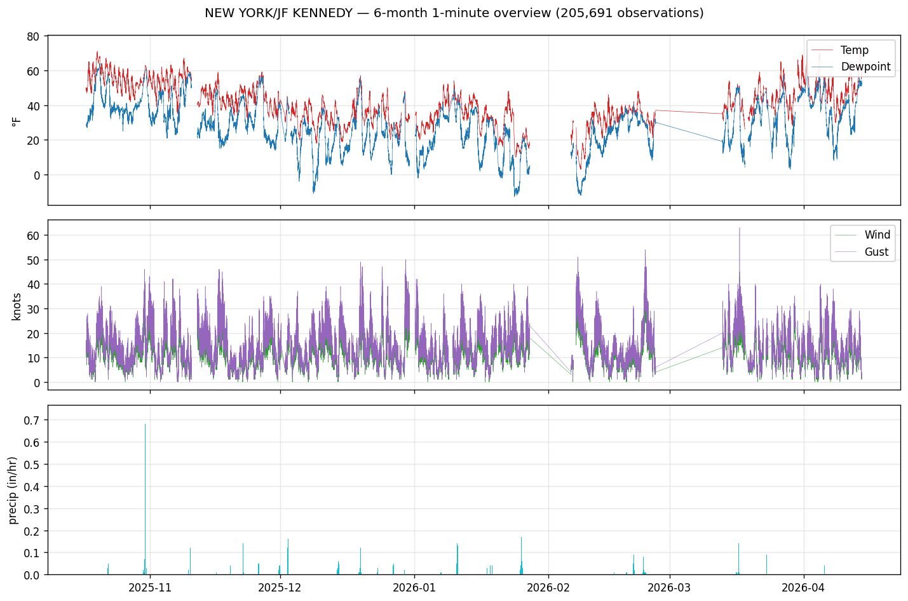

<div align="center">

# ASOS Tools

### Pull NCEI 1-minute surface weather observations by date range &mdash; fast, free, and in Python.

[](https://www.python.org/)
[](#license)
[](#tests)
[](#how-it-works)

<em>~200,000 observations of real 1-minute data in one HTTP call, in ~10 seconds.</em>



</div>

---

## Why this exists

NOAA's National Centers for Environmental Information (NCEI) hosts **1-minute ASOS data** &mdash; wind, temperature, dewpoint, visibility, pressure, and **per-minute precipitation accumulation** &mdash; for hundreds of airports going back to 1998. It's an incredible resource for storm analysis, aviation meteorology, and climate research.

Actually using it has historically been painful:

-  **No Python package.** The canonical toolkit ([`dmhuehol/ASOS-Tools`](https://github.com/dmhuehol/ASOS-Tools)) is MATLAB-only, and only for 5-minute data.
-  **FTP is dead.** NCEI retired `ftp.ncdc.noaa.gov` in 2022; the original MATLAB `ASOSdownloadFiveMin` no longer connects at all.
-  **Monthly-file downloads.** Even working tools pull entire monthly `.dat` files and subset locally &mdash; wasteful when you only want a three-hour storm window.
-  **No official API for 1-minute data.** NCEI's [Access Data Service v1 API](https://www.ncei.noaa.gov/support/access-data-service-api-user-documentation) exposes aggregated products (`daily-summaries`, `global-hourly`) but *not* the 1-minute or 5-minute ASOS archives &mdash; confirmed against their current [dataset catalogue](https://www.ncei.noaa.gov/access/services/support/v3/datasets.json).

**This package fixes all four.** It queries the [Iowa Environmental Mesonet (IEM) ASOS 1-minute service](https://mesonet.agron.iastate.edu/request/asos/1min.phtml), which ingests NCEI's archive and subsets server-side by date range. You get the minutes you asked for, in a `pandas.DataFrame`, in seconds.

## Quick start

```bash
pip install -e .
```

```python
from datetime import datetime, timezone
from asos_tools import fetch_1min

t0 = datetime(2024, 1, 15, 12, 0, tzinfo=timezone.utc)
t1 = datetime(2024, 1, 15, 15, 0, tzinfo=timezone.utc)

df = fetch_1min("KORD", t0, t1)
print(df[["valid", "tmpf", "dwpf", "precip"]].head())
```

```
                   valid  tmpf  dwpf  precip
0  2024-01-15 12:00+00:00  -10.0  -16.0    0.0
1  2024-01-15 12:01+00:00   -9.0  -16.0    0.0
2  2024-01-15 12:02+00:00  -10.0  -16.0    0.0
...
```

That's it.

## What you get

| Feature                                                              |                    |
| -------------------------------------------------------------------- | :----------------: |
| 1-minute resolution (temp, dewpoint, wind, gust, pressure, precip, visibility) | ✅ |
| Server-side date-range subsetting &mdash; no monthly downloads       | ✅ |
| Cross-month & cross-year queries in a single call                    | ✅ |
| Multi-station queries (comma-separated)                              | ✅ |
| K-prefix station IDs (`KORD`, `KJFK`) handled automatically          | ✅ |
| Missing-value sentinels (`M`) coerced to `NaN`                       | ✅ |
| Timezone-aware UTC `pandas.Timestamp`                                | ✅ |
| No auth, no token, no FTP                                            | ✅ |
| Zero MATLAB license required                                         | ✅ |

## Examples

### Multi-station, cross-month boundary

```python
from datetime import datetime, timezone
from asos_tools import fetch_1min

df = fetch_1min(
    ["KJFK", "KLGA", "KEWR"],
    datetime(2024, 1, 31, 23, 0, tzinfo=timezone.utc),
    datetime(2024, 2,  1,  2, 0, tzinfo=timezone.utc),
    variables=["tmpf", "dwpf", "precip"],
)
```

IEM handles the month boundary server-side; you get one tidy DataFrame back.

### Six months of 1-minute data in one request

```bash
python examples/fetch_last_6_months.py --station KJFK
```

Real run on a home internet connection:

```
Fetching KJFK from 2025-10-17 to 2026-04-15
(~6 months of 1-minute data)

Elapsed: 10.6s
Rows:    205,692
Total precip over window: 12.28 in
```

The hero plot at the top of this README is generated from exactly this call &mdash; see `examples/plot_6_month_overview.py`.

### Customize the variable list

```python
df = fetch_1min("KBOS", t0, t1, variables=["tmpf", "precip"])
```

Full list of IEM variable names: see [Variables returned](#variables-returned) below.

## How it works

```
          ┌──────────────────┐
          │   Your Python    │
          │   (asos_tools)   │
          └────────┬─────────┘
                   │ HTTPS GET, ?station=…&sts=…&ets=…
                   ▼
          ┌──────────────────┐
          │  IEM asos1min    │          (Iowa State)
          │  CGI service     │
          └────────┬─────────┘
                   │ subsets the underlying monthly files
                   ▼
          ┌──────────────────┐
          │  NCEI archive    │          (NOAA)
          │  asos-1min-pg1/  │
          │  asos-1min-pg2/  │
          └──────────────────┘
```

The NCEI archive lives at
[`https://www.ncei.noaa.gov/data/automated-surface-observing-system-one-minute-pg1/access/YYYY/MM/asos-1min-pg1-KXXX-YYYYMM.dat`](https://www.ncei.noaa.gov/data/automated-surface-observing-system-one-minute-pg1/access/).
IEM re-exposes it with a query interface. `asos_tools.fetch_1min` builds the query, streams the CSV, coerces dtypes, and returns a DataFrame.

## Comparison to the MATLAB original

| aspect                                | `dmhuehol/ASOS-Tools` (MATLAB)                    | `asos_tools` (this repo)                          |
| ------------------------------------- | ------------------------------------------------- | ------------------------------------------------- |
| Language                              | MATLAB R2017a+                                    | Python 3.9+                                       |
| License cost                          | MATLAB seat                                       | free                                              |
| Data resolution                       | 5-minute                                          | **1-minute** (+ 5-minute on the roadmap)          |
| Transport                             | FTP (**broken since 2022**)                       | HTTPS                                             |
| Date-range fetching                   | full months, subset client-side                   | server-side subsetting                            |
| Precipitation amount                  | **not available** at 5-min                        | available every minute                            |
| Lines of code for "pull a data range" | ~150                                              | 25                                                |
| Tests                                 | none                                              | 14 (`pytest`)                                     |

The original MATLAB code, docs, and plotting functions (`surfacePlotter`, `stormFinder`, `weatherCodeSearch`) are preserved in [MATLAB.md](MATLAB.md) and the `.m` files at the repo root, for users who rely on that workflow.

## API reference

### `fetch_1min(stations, start, end, *, variables=None, timezone_label="UTC", timeout=120.0, session=None) -> pd.DataFrame`

Fetch 1-minute observations for a UTC date range.

| arg               | type                           | description                                                                          |
| ----------------- | ------------------------------ | ------------------------------------------------------------------------------------ |
| `stations`        | `str` \| `Iterable[str]`       | ICAO-style ID or list of them. Leading `K` is stripped for 4-char US stations.      |
| `start`, `end`    | `datetime`                     | Naive datetimes treated as UTC; aware datetimes converted to UTC. `end` > `start`.   |
| `variables`       | `Sequence[str]`, optional      | IEM variable names; defaults to the full set (see below).                            |
| `timezone_label`  | `str`, default `"UTC"`         | IANA timezone passed to IEM's `tz` parameter. Returned timestamps are always UTC.    |
| `timeout`         | `float`, default `120`         | Request timeout in seconds.                                                          |
| `session`         | `requests.Session`, optional   | Reuse a session across many calls for connection pooling.                            |

Returns a `pandas.DataFrame` with columns:

- `station` &mdash; 3-letter FAA identifier (e.g. `ORD`)
- `station_name` &mdash; human-readable name
- `valid` &mdash; tz-aware UTC `pd.Timestamp`
- one column per requested variable

Sorted ascending by `valid`, then `station`.

### `normalize_station(station: str) -> str`

Applied automatically; exposed for completeness. Returns the IEM-native station ID.

## Variables returned

| name         | units         | meaning                                                  |
| ------------ | ------------- | -------------------------------------------------------- |
| `tmpf`       | °F            | air temperature                                          |
| `dwpf`       | °F            | dewpoint                                                 |
| `sknt`       | knots         | 2-minute mean wind speed                                 |
| `drct`       | degrees       | 2-minute mean wind direction                             |
| `gust_sknt`  | knots         | peak 1-minute wind gust                                  |
| `vis1_coeff` | 1/mi          | primary visibility sensor extinction coefficient         |
| `vis1_nd`    | `N`/`D`       | primary visibility sensor night/day flag (text)          |
| `pres1`      | in Hg         | station pressure                                         |
| `precip`     | inches        | 1-minute precipitation accumulation                      |

Missing readings are returned as `NaN` (IEM sends the sentinel `M`, which this package coerces).

## Tests

```bash
pytest -v                    # all 14 (offline + live)
pytest -m "not live" -v      # 11 offline only
pytest -m live -v            # 3 live only
```

The offline suite uses a bundled CSV fixture at `tests/fixtures/kord_20240115_1200_1500.csv` captured from a real IEM response. The live suite verifies actual end-to-end behavior (single station, cross-month, multi-station) against the real endpoint.

Current status: **14 passing, 0 failing.**

## Roadmap

- [ ] `fetch_5min` &mdash; direct NCEI HTTPS pull of the 5-minute archive with client-side subsetting (IEM does not currently expose 5-min).
- [ ] `storm_finder` &mdash; port of the MATLAB `stormFinder.m` peak-intensity heuristic, with precip-amount support (now possible thanks to 1-minute pg2 data).
- [ ] `surface_plotter` &mdash; port of the MATLAB `surfacePlotter.m` abacus + timeseries plots, built on `matplotlib`.
- [ ] Optional on-disk Parquet cache so repeat queries are instant.
- [ ] Package distribution on PyPI.

## MATLAB users

If you rely on the original MATLAB workflow, every `.m` file from [dmhuehol/ASOS-Tools](https://github.com/dmhuehol/ASOS-Tools) is still here, and [MATLAB.md](MATLAB.md) preserves the original documentation. A MATLAB version of the date-range fetch (`asosFetch1Min.m`) is also included alongside the Python package.

## Contributing

```bash
git clone <this-repo>
cd ASOS-Tools
pip install -e ".[dev]"
pytest
```

PRs welcome. See [Roadmap](#roadmap) for open work.

## Credits & lineage

- Original MATLAB toolkit, 5-minute plotting, storm-finder algorithm &mdash; **Daniel Hueholt**, North Carolina State University, [Environment Analytics](http://www.environmentanalytics.com) (2020).
- ASOS 1-minute CSV service &mdash; [**Iowa Environmental Mesonet**](https://mesonet.agron.iastate.edu/), Daryl Herzmann and contributors.
- Raw 1-minute archive &mdash; [**NOAA / NCEI**](https://www.ncei.noaa.gov/).
- Python port and date-range architecture &mdash; this repository.

## License

MIT. See [LICENSE](LICENSE).
