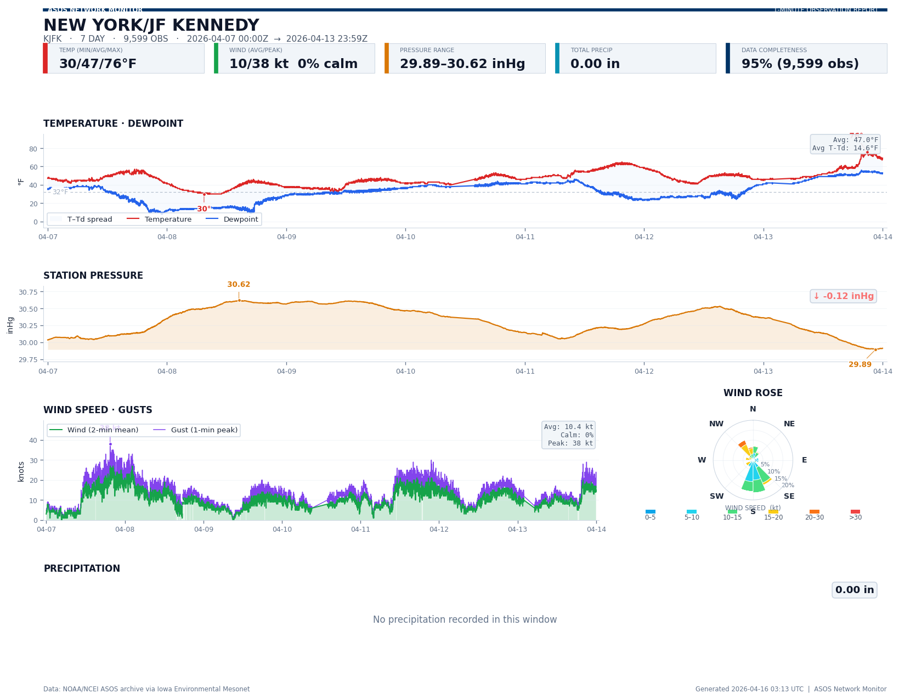
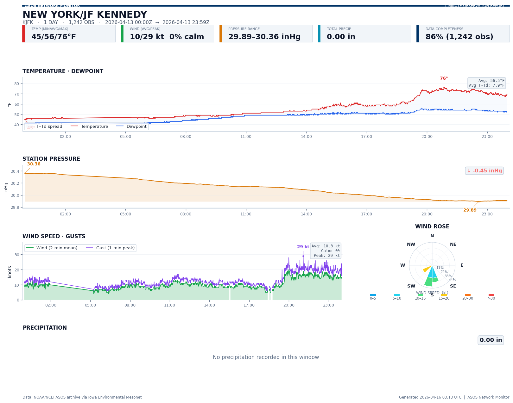
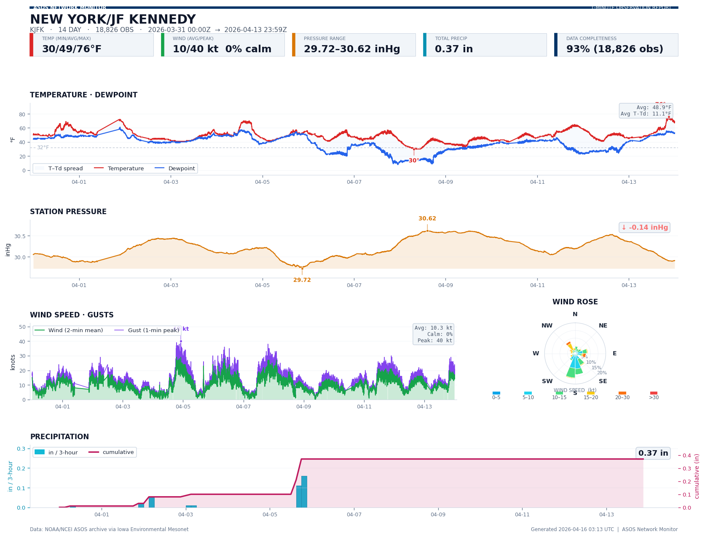
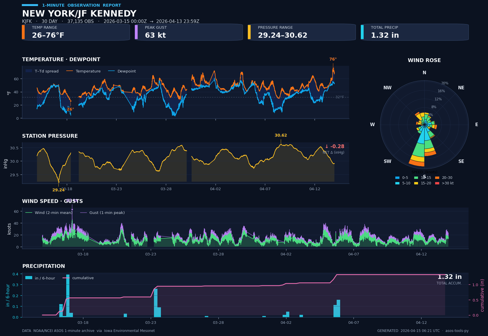
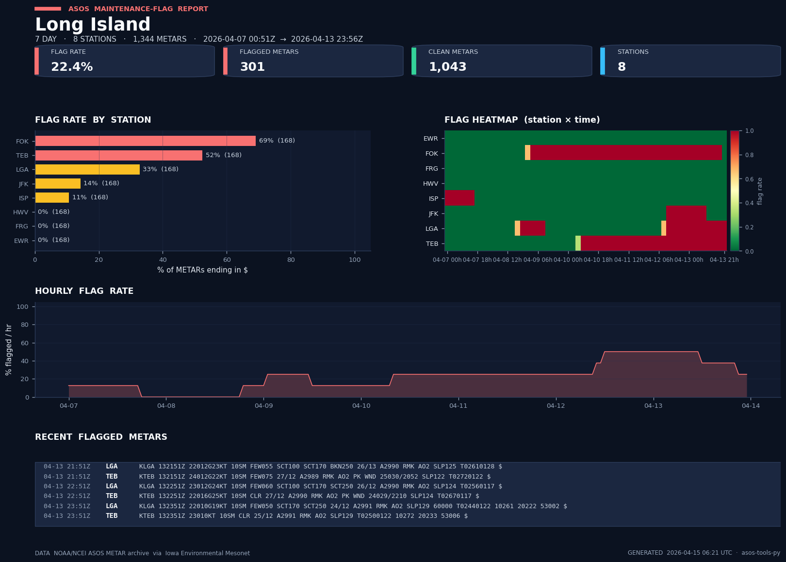
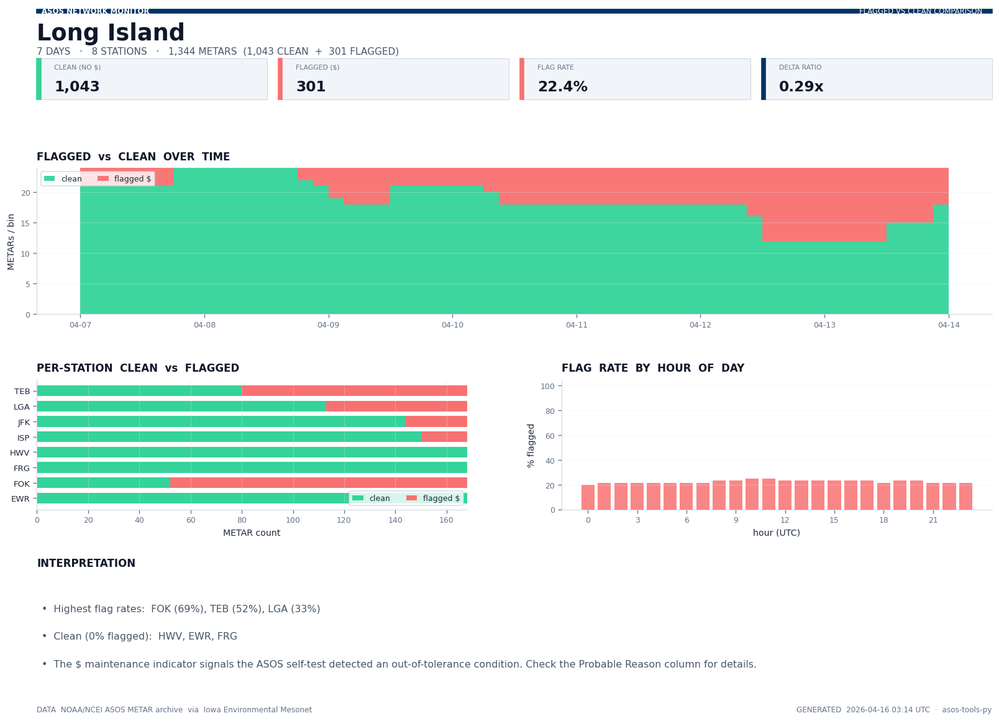

<div align="center">

# ASOS Tools

### Pull NCEI 1-minute surface weather observations by date range &mdash; fast, free, and in Python.

[](https://www.python.org/)
[](#license)
[](#tests)
[](#how-it-works)
[](https://huggingface.co/spaces/consgicody/asos-tools)

### 🚀 Live demo: **[huggingface.co/spaces/consgicody/asos-tools](https://huggingface.co/spaces/consgicody/asos-tools)**

<em>~200,000 observations of real 1-minute data in one HTTP call, in ~10 seconds.<br/>
Plus: ASOS maintenance-flag tracking, preset station groups, and an interactive Streamlit dashboard.</em>



</div>

---

## Why this exists

NOAA's National Centers for Environmental Information (NCEI) hosts **1-minute ASOS data** &mdash; wind, temperature, dewpoint, visibility, pressure, and **per-minute precipitation accumulation** &mdash; for hundreds of airports going back to 1998. It's an incredible resource for storm analysis, aviation meteorology, and climate research.

Actually using it has historically been painful:

- **No Python package.** The canonical toolkit ([`dmhuehol/ASOS-Tools`](https://github.com/dmhuehol/ASOS-Tools)) is MATLAB-only, and only for 5-minute data.
- **FTP is dead.** NCEI retired `ftp.ncdc.noaa.gov` in 2022; the original MATLAB `ASOSdownloadFiveMin` no longer connects at all.
- **Monthly-file downloads.** Even working tools pull entire monthly `.dat` files and subset locally &mdash; wasteful when you only want a three-hour storm window.
- **No official API for 1-minute data.** NCEI's [Access Data Service v1 API](https://www.ncei.noaa.gov/support/access-data-service-api-user-documentation) exposes aggregated products (`daily-summaries`, `global-hourly`) but *not* the 1-minute or 5-minute ASOS archives &mdash; confirmed against their current [dataset catalogue](https://www.ncei.noaa.gov/access/services/support/v3/datasets.json).

**This package fixes all four.** It queries the [Iowa Environmental Mesonet (IEM) ASOS 1-minute service](https://mesonet.agron.iastate.edu/request/asos/1min.phtml), which ingests NCEI's archive and subsets server-side by date range. You get the minutes you asked for, in a `pandas.DataFrame`, in seconds.

## Quick start

```bash
pip install -e .
```

```python
from datetime import datetime, timezone
from asos_tools import fetch_1min

t0 = datetime(2024, 1, 15, 12, 0, tzinfo=timezone.utc)
t1 = datetime(2024, 1, 15, 15, 0, tzinfo=timezone.utc)

df = fetch_1min("KORD", t0, t1)
print(df[["valid", "tmpf", "dwpf", "precip"]].head())
```

That's it.

## What you get

| Feature                                                                        |  |
| ------------------------------------------------------------------------------ | :-: |
| 1-minute resolution (temp, dewpoint, wind, gust, pressure, precip, visibility) | ✅ |
| Server-side date-range subsetting &mdash; no monthly downloads                 | ✅ |
| Cross-month & cross-year queries in a single call                              | ✅ |
| Multi-station queries                                                          | ✅ |
| **Preset station groups** (Long Island, NE US, Front Range, Utah, hubs, …)     | ✅ |
| **ASOS maintenance-flag tracking** (`$` indicator detection)                   | ✅ |
| **Flagged-vs-clean comparison reports**                                        | ✅ |
| **Dashboard-style report generator** (dark theme, wind roses, annotated)       | ✅ |
| **Streamlit web dashboard** (deployable in 3 min to Hugging Face Spaces)       | ✅ |
| K-prefix station IDs (`KORD`, `KJFK`) handled automatically                    | ✅ |
| Missing-value sentinels (`M`) coerced to `NaN`                                 | ✅ |
| Timezone-aware UTC `pandas.Timestamp`                                          | ✅ |
| No auth, no token, no FTP                                                      | ✅ |
| Zero MATLAB license required                                                   | ✅ |

## Report gallery

### 1-minute station dashboards

Same station (KJFK), four different time scales &mdash; generated by one command:

```bash
python examples/build_reports.py --station KJFK
```

<table>
<tr>
<td><strong>1 day</strong><br></td>
<td><strong>7 day</strong><br></td>
</tr>
<tr>
<td><strong>14 day</strong><br></td>
<td><strong>30 day</strong><br></td>
</tr>
</table>

Each report includes:
- Title strip with station, window, obs count, and KPI chips (temp range, peak gust, pressure range, total precip)
- Temperature + dewpoint panel with T&ndash;T<sub>d</sub> spread shaded and extremes annotated
- Station pressure with net-change indicator
- **Wind rose** (stacked by speed, percent-normalized)
- Wind speed + gust timeseries
- Precipitation bars + cumulative overlay

### Maintenance-flag report (METAR `$` tracking)

The ASOS `$` terminator is the **maintenance-check indicator**: the station has flagged itself as needing maintenance, usually due to a degraded sensor. The maintenance report shows how often each station in a group is flagging, when, and what the flagged METARs look like.

```bash
python examples/build_reports.py --group long_island
```



Panels:
- Per-station flag rate (sorted horizontal bars, green/amber/red)
- Station &times; time heatmap (red = high flag rate that bin)
- Hourly flag-rate timeline
- Sample of recent flagged METARs (raw text)

### Flagged-vs-clean comparison report

```bash
python examples/build_reports.py --group long_island     # same command, also builds the comparison
```



Panels:
- Stacked flagged-vs-clean count over time
- Per-station flagged vs clean breakdown
- Flag rate by hour of day (does maintenance flagging correlate with time of day?)
- Plain-English interpretation with the worst-offending stations and the fully-clean stations

## Interactive Streamlit dashboard

An interactive version of all three report types is in [`app.py`](app.py):

```bash
pip install -r requirements.txt
streamlit run app.py
```

The dashboard lets you pick a single station, a preset group (Long Island, Northeast US, Front Range, Utah, major hubs, &hellip;), or a custom list, plus a 1/7/14/30-day window, and renders a report you can download as PNG.

### Deploy it

See [`DEPLOY.md`](DEPLOY.md) for a full platform comparison. Short list:

- **Hugging Face Spaces** &mdash; ⭐ our recommendation. Free, no cold starts, purpose-built for data dashboards. ~3 minutes to deploy.
- **Streamlit Community Cloud** &mdash; one-click from a GitHub repo, native `*.streamlit.app` URL.
- **Fly.io** &mdash; if you want custom domain + always-on, ship the included Dockerfile snippet.
- **Railway / Render** &mdash; both work; Railway is cleaner DX, Render is free-tier-with-cold-starts.

**Not recommended for this app:** Vercel / Netlify / Cloudflare Pages. Those are optimized for edge/static/Node, and serverless Python + matplotlib is more pain than it's worth.

## Preset station groups

Available via `asos_tools.stations`:

| Group                   | Stations                                                              |
| ----------------------- | --------------------------------------------------------------------- |
| `long_island`           | KISP, KHWV, KFRG, KFOK, KJFK, KLGA, KEWR, KTEB                        |
| `northeast`             | KHVN, KBDR, KGON, KVAY, KTTN, KCDW, KSMQ, KACY, KHPN, KFWN, KPOU, …   |
| `co_located_radiosonde` | KGSO, KFFC, KALB, KDET, KCAR, KHQM, KBIS                              |
| `front_range`           | KAPA, KDEN, KCYS, KLAR                                                |
| `utah`                  | KLGU, KOGD, KSLC                                                      |
| `major_hubs`            | KATL, KBOS, KCLT, KDEN, KDFW, KIAD, KIAH, KJFK, KLAS, KLAX, KMCO, …   |
| `coastal_east`          | KBOS → KJAX up the East Coast                                         |
| `great_lakes`           | KORD, KMKE, KGRR, KDET, KCLE, KBUF, KROC, KERI, KSYR, KDTW            |
| `gulf_coast`            | KHOU, KIAH, KLCH, KMSY, KBIX, KMOB, KPNS, KPIE, KTPA, KRSW            |
| `alaska_pacific`        | PANC, PAFA, PAJN, PHNL, PHOG, PHTO, PGUM                              |

Usage:

```python
from asos_tools import fetch_1min, fetch_metars
from asos_tools.stations import LONG_ISLAND, get_group

df = fetch_1min(LONG_ISLAND, t0, t1)
mt = fetch_metars(get_group("front_range"), t0, t1)
```

## Examples

### Multi-station, cross-month boundary

```python
df = fetch_1min(
    ["KJFK", "KLGA", "KEWR"],
    datetime(2024, 1, 31, 23, 0, tzinfo=timezone.utc),
    datetime(2024, 2,  1,  2, 0, tzinfo=timezone.utc),
    variables=["tmpf", "dwpf", "precip"],
)
```

### Six months of 1-minute data in one request

```bash
python examples/fetch_last_6_months.py --station KJFK
```

Real run on a home internet connection: 205,692 rows fetched in **10.6s**, total precip 12.28 inches.

### Customize the variable list

```python
df = fetch_1min("KBOS", t0, t1, variables=["tmpf", "precip"])
```

## How it works

```
          ┌──────────────────┐
          │   Your Python    │
          │   (asos_tools)   │
          └────────┬─────────┘
                   │ HTTPS GET, ?station=…&sts=…&ets=…
                   ▼
          ┌──────────────────┐
          │  IEM services    │          (Iowa State)
          │  asos1min.py +   │
          │  asos.py (METAR) │
          └────────┬─────────┘
                   │ subsets the underlying monthly files
                   ▼
          ┌──────────────────┐
          │  NCEI archive    │          (NOAA)
          │  asos-1min-pg1/  │
          │  asos-1min-pg2/  │
          └──────────────────┘
```

The NCEI archive lives at [`www.ncei.noaa.gov/data/automated-surface-observing-system-one-minute-pg1/access/YYYY/MM/asos-1min-pg1-KXXX-YYYYMM.dat`](https://www.ncei.noaa.gov/data/automated-surface-observing-system-one-minute-pg1/access/). IEM re-exposes it with a query interface; this package builds the query, streams the CSV, coerces dtypes, and returns a DataFrame.

## Comparison to the MATLAB original

| aspect                                | `dmhuehol/ASOS-Tools` (MATLAB)                    | `asos_tools` (this repo)                          |
| ------------------------------------- | ------------------------------------------------- | ------------------------------------------------- |
| Language                              | MATLAB R2017a+                                    | Python 3.9+                                       |
| License cost                          | MATLAB seat                                       | free                                              |
| Data resolution                       | 5-minute                                          | **1-minute** (5-minute on roadmap)                |
| Transport                             | FTP (**broken since 2022**)                       | HTTPS                                             |
| Date-range fetching                   | full months, subset client-side                   | server-side subsetting                            |
| Precipitation amount                  | **not available** at 5-min                        | available every minute                            |
| METAR maintenance flag (`$`) tracking | not included                                      | built-in reports                                  |
| Preset station groups                 | listed in README (manual)                         | importable constants                              |
| Web dashboard                         | none                                              | Streamlit app                                     |
| Lines of code for "pull a data range" | ~150                                              | 25                                                |
| Tests                                 | none                                              | 28 (`pytest`)                                     |

The original MATLAB code, docs, and plotting functions (`surfacePlotter`, `stormFinder`, `weatherCodeSearch`) are preserved in [MATLAB.md](MATLAB.md) and the `.m` files at the repo root, for users who rely on that workflow.

## API reference

### `fetch_1min(stations, start, end, *, variables=None, timezone_label="UTC", timeout=120.0, session=None) -> pd.DataFrame`

Fetch 1-minute observations for a UTC date range. Leading `K` is stripped for 4-char US stations. Returns a DataFrame with `station`, `station_name`, `valid` (tz-aware UTC), plus one column per requested variable. Sorted by `valid` then `station`.

### `fetch_metars(stations, start, end, *, timeout=120.0, session=None) -> pd.DataFrame`

Fetch raw METAR/SPECI reports. Returns a DataFrame with `station`, `valid`, `metar` (raw text), and `has_maintenance` (bool; True iff the METAR ends with `$`).

### `has_maintenance_flag(metar: str) -> bool`

Pure helper for detecting the ASOS `$` maintenance-check indicator on an arbitrary METAR string. Handles a trailing `=` terminator, whitespace, and `None`/`NaN` inputs.

### `build_report(df, *, window_label, station_id, station_name, out_path)`

Render a full 1-minute dashboard report from a `fetch_1min` DataFrame.

### `build_maintenance_report(metars_df, *, group_label, window_label, out_path)`

Render the `$`-flag dashboard from a `fetch_metars` DataFrame.

### `build_comparison_report(metars_df, *, group_label, window_label, out_path)`

Render the flagged-vs-clean comparison dashboard.

### `asos_tools.stations`

Exported constants (`LONG_ISLAND`, `NORTHEAST`, `FRONT_RANGE`, `UTAH`, `MAJOR_HUBS`, `COASTAL_EAST`, `GREAT_LAKES`, `GULF_COAST`, `ALASKA_PACIFIC`, `CO_LOCATED_RADIOSONDE`) plus `GROUPS`, `get_group(name)`, `list_groups()`, `all_stations()`.

## Variables returned by `fetch_1min`

| name         | units         | meaning                                                  |
| ------------ | ------------- | -------------------------------------------------------- |
| `tmpf`       | °F            | air temperature                                          |
| `dwpf`       | °F            | dewpoint                                                 |
| `sknt`       | knots         | 2-minute mean wind speed                                 |
| `drct`       | degrees       | 2-minute mean wind direction                             |
| `gust_sknt`  | knots         | peak 1-minute wind gust                                  |
| `vis1_coeff` | 1/mi          | primary visibility sensor extinction coefficient         |
| `vis1_nd`    | `N`/`D`       | primary visibility sensor night/day flag (text)          |
| `pres1`      | in Hg         | station pressure                                         |
| `precip`     | inches        | 1-minute precipitation accumulation                      |

Missing readings are `NaN`.

## Tests

```bash
pytest -v                    # all 28 (offline + live)
pytest -m "not live" -v      # 24 offline only
pytest -m live -v            # 4 live only
```

Current status: **28 passing, 0 failing.**

## Roadmap

- [x] ~~Published live demo on Hugging Face Spaces~~ → [consgicody/asos-tools](https://huggingface.co/spaces/consgicody/asos-tools)
- [ ] `fetch_5min` &mdash; direct NCEI HTTPS pull of the 5-minute archive
- [ ] `storm_finder` &mdash; port of the MATLAB `stormFinder.m`, with precip-amount scoring
- [ ] `surface_plotter` &mdash; port of the MATLAB `surfacePlotter.m` abacus plot
- [ ] Optional on-disk Parquet cache for repeat queries
- [ ] Package on PyPI
- [ ] Field-level comparison in `build_comparison_report` (tmpf/pres distributions for flagged vs clean subsets)

## MATLAB users

If you rely on the original MATLAB workflow, every `.m` file from [dmhuehol/ASOS-Tools](https://github.com/dmhuehol/ASOS-Tools) is still here, and [MATLAB.md](MATLAB.md) preserves the original documentation. A MATLAB version of the date-range fetch (`asosFetch1Min.m`) is also included.

## Contributing

```bash
git clone <this-repo>
cd asos-tools-py
pip install -e ".[dev]"
pytest
```

PRs welcome. See [Roadmap](#roadmap) for open work.

## Credits & lineage

- Original MATLAB toolkit, 5-minute plotting, storm-finder algorithm &mdash; **Daniel Hueholt**, North Carolina State University, [Environment Analytics](http://www.environmentanalytics.com) (2020).
- ASOS 1-minute CSV service &mdash; [**Iowa Environmental Mesonet**](https://mesonet.agron.iastate.edu/), Daryl Herzmann and contributors.
- Raw 1-minute archive &mdash; [**NOAA / NCEI**](https://www.ncei.noaa.gov/).
- Python port, dashboard reports, maintenance-flag tracking, Streamlit app &mdash; this repository.

## License

MIT. See [LICENSE](LICENSE).
